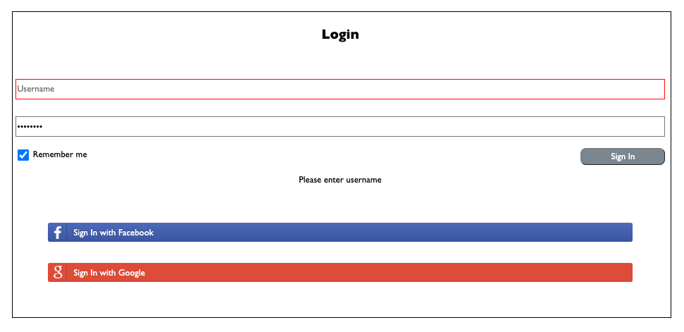
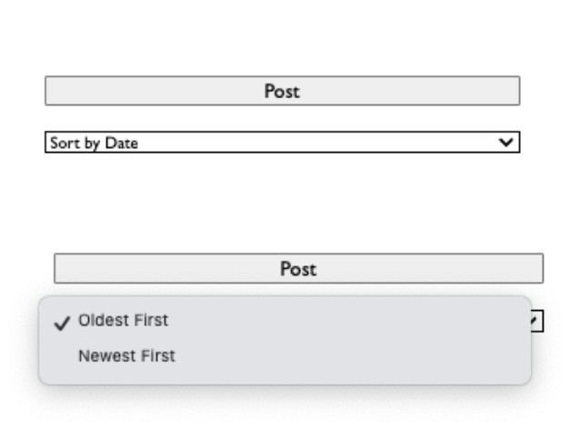

# Inclusive Jobseeker Social Site

---

# Intro

This project was created in my 4th week of coding bootcamp at General Assembly using JavavScript, HTML, and CSS.

## Purpose

I've created the basic framework for a hypothetical site called Refer-all.
This social site allows users to share job referral opportunities to other users who are seeking jobs.
Users can:

- Use the like button and comment button to directly engage with referrals
- Search for referral opportunities based on keyword to get ones that match your preference.
- Sort referral opportunities based on date posted to get the freshest ones.


---

# Functionality

## Log In Validation

Upon page load, an event listener appended to the sign in button runs a checkInfo function when clicked. If it returns true (in other words, only when username and password are not blank), then the sign in button will redirect to the Home Page. Although actual authentication is not required, the interface simulates this process.

The `checkInfo` function also will checks for missing username and/or password. The missing field will have an error message appended below along with a red border. This is done respectively with `.textContent` and `.classList.add`. To ensure no incorrect border is added, we nest if/else statements that allow us to remove the red border if the section is filled in.



## Dark Mode

The dark mode toggle once toggled on will change the background and text color of the page to accommodate dark mode. It is then saved to local storage. This "allows JavaScript sites and apps to save key-value pairs in a web browser with no expiration date." It is then ported over to the Home Page This way, whatever the user chooses- say you chose dark mode and your login page is dark, then your next page on signing in will be dark.

On the home page, upon load, it checks if dark mode was enabled in local storage and makes the page dark mode as well. Some additional styling was added to ensure that other aspects of the page correctly conform to dark mode.


## Welcome Message (Home)

The username is saved to local storage through localStorage.setItem as well. String interpolation is then used to display the welcome message. This allows for a more customized feel.


## New Posts

The homepage includes an freeform box to write a post. Only when the Post button is clicked then is the post added to postedContentLog div (which the bottom section under the search and sort-by dropdown.)

The date is displayed with new Date() function and this is appended to posts.

Callback functions are then used to for making the list button and making a comment. We chain it that way, because they would only exist if a post was made.

## Like and Like Counter

The like button is then created and appended under each post. An event listener is added so that the like count increases. The function initalized with a global variable outside with value of 0. Then with each click, the count increases by 1. This amount is then appended to the like button's inner text with string interpolation.

## Comment

A comment box appears under each post as a div and within an input box exists for the user to type a comment. We do it this way in order to append other items under the comment box. Input can't have child elements, so we had to start with a div.

To avoid old comments from staying in the input box, we clear it out each time with This is done by `newCommentBoxInput.value = ""`, thus allowing us to reset.

Next a comment button is created and appended below. Each time, this comment button is clicked, the user's input is then logged below in another created div. Each div then has a delete button created and added. Once the delete button is clicked, the user's comment is deleted.

## Search and Sort By

Note: Below are details of my initial approach. This has been fixed retroactively and more details are under [What I Learned](https://github.com/ashleyd480/inclusive-jobseeker-referral-site?tab=readme-ov-file#what-i-learned).

To allow the posts to be searched, my inital approach (now fixed) was to have a global array initialized in my `blog.js`. This way, each time a post is made, its information of content (what the user types), date, and comments are all added into an object. Each post has this object of key value pairs. These are then pushed into an array.
[Post 1 Object, Post 2 Object, etc]

When the search button is clicked, the function checks what the user is searching for. It filters the array of new posts by checking if they include the search term.

Then, to display these results, another function clears out the postedContentLog to make room to display the results and then appends the matching posts below in a div we create called `searchedPost`. The text content will be whatever each matching post has- represented via `searchedPost.textContent = post.content`. Similarly that is how the comments are added.

Similarly, we use the sorting function to sort the array of posts based on what the user selects in the dropdown- oldest firs tor newest first. It uses the same concept of the array of posts containing the information. Keep in mind, we created the date variable in a post and this then is used to determine sort order. This sorted content is then displayed below.

## Fetch API

We use math random to pick a random picture from our picture API. This random number is the index of the array of pictures we choose from. We get the download URL from the object pair and this URL is then appended to the image element we have created to show in HTML. This is displayed on desktop only, as an aside.

---

# Styling

`styles.css` houses common styles to be utilized across all pages. Any page-specific styles are defined on additional respective CSS files. I was able to plan this by drafting a table of which class styles are shared and which aren't.

## Mobile Design

The site is mobile responsive, built with mobile first in mind.
On mobile devices (less than or equal to 768px):

- The navigation bar displays the the website name and a personalized greeting ("Hi, {username}") in the header.
- A hamburger menu replaces the header content when activated, displaying links and a user profile picture.

Additional media query is customized to have the content to visually fit on both mobile and desktop.


## Accesibility

The page was designed to be more accessible in terms of being easier on the eyes by not having the items be too small. The height & font size of input fields along with sign in for username and password were increased. The font-size is adjusted by the mediumFont and largeFont class.

Flexbox is used to position elements on page. Margins, padding, gaps were used to better space apart elements to avoid crowding of content. Thick borders are used to better seperate the aside and the central content.

Additonally, placeholders are added to the input boxes to make it easier to understand what is needed in each field.

## Scroll bar

Each post should only display 4 comments. Then, a scroll bar should appear (as defined by `overflow:scroll`, which means scroll bars are added to the container to allow the user to scroll through the overflowed content that exceeds the "limit" of 4 posts.). This is done by counting how many comments in the node. We found that keeping the container to 500px and the overflow:scroll, it allowed it to fit the 4.

## Misc

To avoid the buttons being too overly large, custom sizing was applied using width definitions in CSS. Formatting is also applied via classList.add to our DOM elements in javscript- including borders and indents, allowing each comment to be in its own box.

## Credits

Credit to [Davide Rizzo](https://codepen.io/davidelrizzo/pen/vEYvyv) for the login button formatting CSS.
I simplified the code by removing the styling for hover and focus actions. I also made the width of the buttons to be 90% to match the GA wireframe.

Credit to [Gaurav](https://dev.to/devggaurav/let-s-build-a-responsive-navbar-and-hamburger-menu-using-html-css-and-javascript-4gci) for the hamburger tutorial.

---

# What I Learned

## CSS Troubleshooting

- Adding temporary colored borders around the flexbox containers help me better visualize my flexboxes and where items are laid out.
- After clicking on inspect console, you can either hover over the element or click on the element in the console code window. This opens up Styles, and from there, you can see the CSS formatting, and check/uncheck settings.

## CSS tips

- `vertical-align: middle` fixed the alignemnt of the "remember me" checkbox in my log-in page. The checkbox is aligned with vertically with the middle of the text within the same line.
- `margin: 0 auto` centers my login screen on the home page on mobile view.
- To set a placeholder in a dropdown, we can use use this template below.
  In this case, the placeholder value is "Sort By Date" and it's "disabled" meaning it can't be selected, and additionallly it's "hidden" meaning that attribute is hidden from the list (once the list unfurls, that option no longer shows)

```
<option value="" class="dateOption" disabled selected hidden>Sort by Date</option>
```



## DOM Troubleshooting

### Event Listeners

- To see if an event listener is working, you can add a console.log within the code. With the example code block below, I can click on my post button, and check in console to see if that message has appeared. This will confirm that everything is working properly.

```
postButton.addEventListener("click", function ()) {
    console.log("Post button clicked!");
}
```

- To add an event listener to a toggle/checkbox, you will want to query that element in the DOM by its input. In the example below, we target the input of the dark mode button's toggle.

```
const darkModeBtn = document.querySelector("#darkModeBtn input[type='checkbox']");
```

### Chaining

- You can chain two classes in DOM manipulation by the use of a comma.

```
 newComment.classList.add("lightModeBorder", "jsNewComment");
```

### Self-closing Elements

- You can't append elements in DOM to self-closing elements. This is because self-closing elements can't have children. An example, is when I tried to append buttons under my commment box. Since it was an `input` element at that time, buttons were not appending underneath. This was fixed when I created `newCommentBox` instead as a div, and then within that created the input via `const newCommentBoxInput = document.createElement("input");`

## window.location.href

We don't want to directly add a URL to the sign-in button in our HTML, as we only want it to redirect if the sign-in credentials were correctly filled in.
Having the URL embedded in the button means having to prevent that default behavior. The `window.location.href` combined with if/else solves that issue by allowing the sign-in button to only redirect to the blog once sign-in validation is passed.

## console.log

Always keep console.log open to check for reference errors. These type of errors are where a variable in JavaScript is not defined or not in scope. One way to resolve this is passing along those variables as parameters.

## Spread Operator

Our initial code initialized an empty postArray variable. However, this creates two sources of truth. (This is because the DOM is the source of truth, however the the initial postArray was creating another source of truth.)

With a spread operator, this essentially creates a copy of the array of children within the postedContentLog such as comments, buttons, etc (which were appended underneath it). As such, `const posts = [...postedContentLog.children];` is creating that copy of the array and assigning it variable of `posts`. (You can visualize this array with a `console.dir` command and see the tree of children.) 

From there, we can then just apply the sorting and search function. For example, with search, we use the filter method to filter the array to include only ones that inluce the search term, and then that filtered array is iterated through- resulting in the matching posts and their children being appended.


## Dataset
In the code below, `date` is being added as a dataset attribute to `newPost`. These attributes exist within the `newPost` element's opening tag.

```
const postDate = getCurrentDate(); // Get the current date
newPost.dataset.date = postDate; 
```
`new Date(a.dataset.date)` and `new Date(b.dataset.date)` are used in the sorting function since datasets return the date as a string, and Data () converts it back to a date value. `new` creates instances of those dates  to allow for comparison. 

